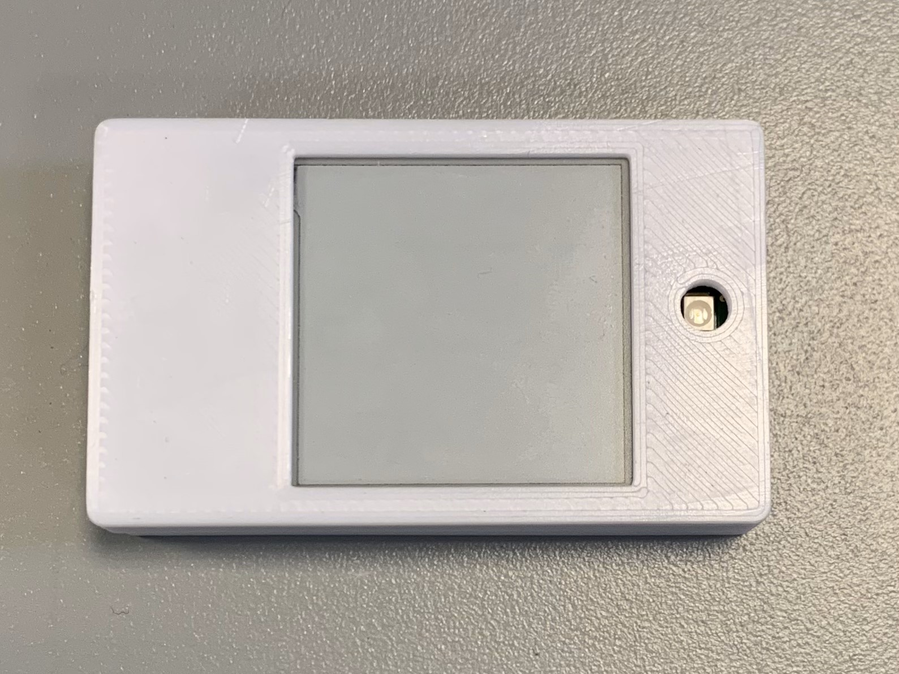
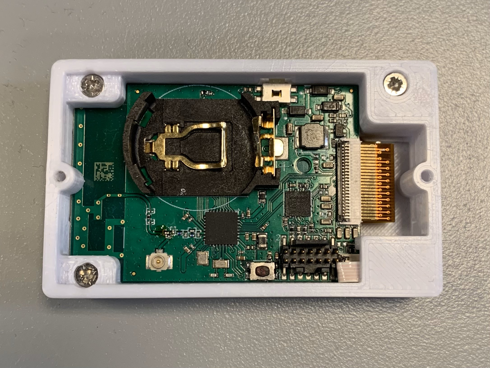
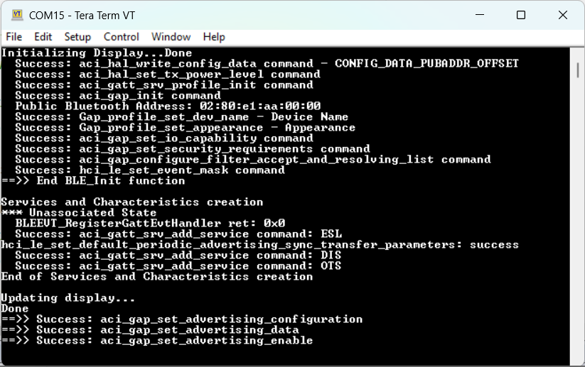
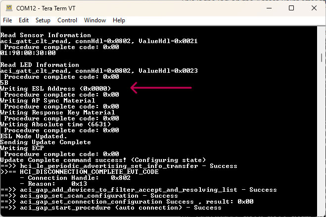
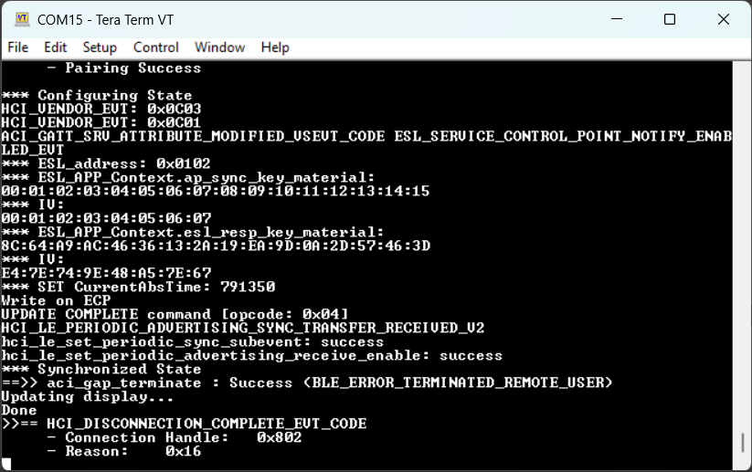
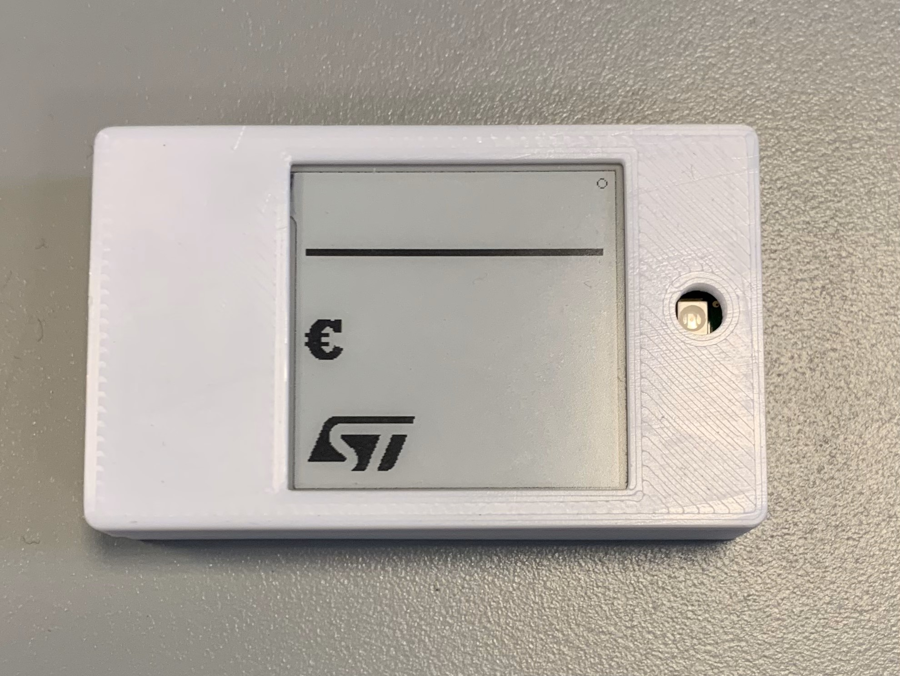
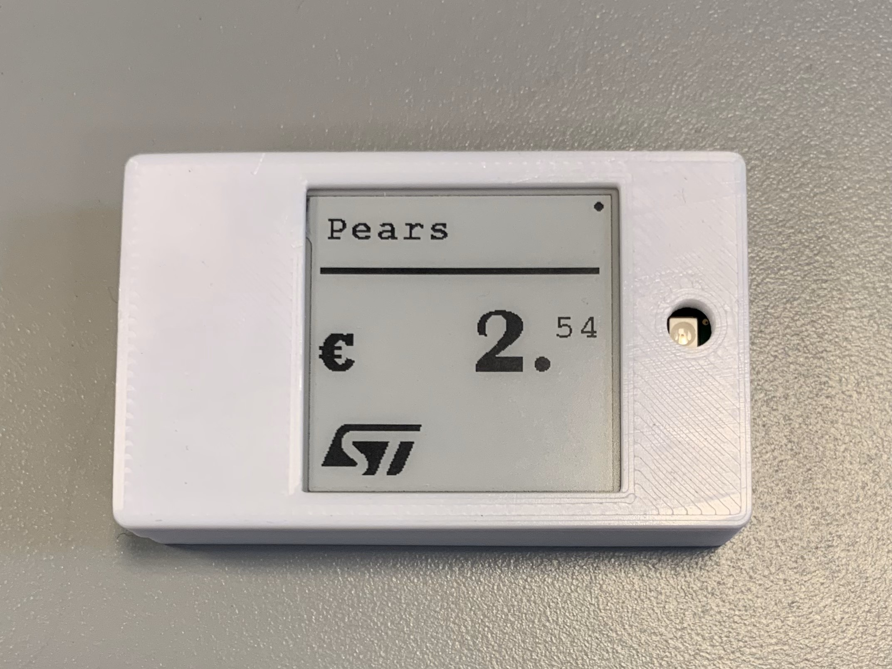
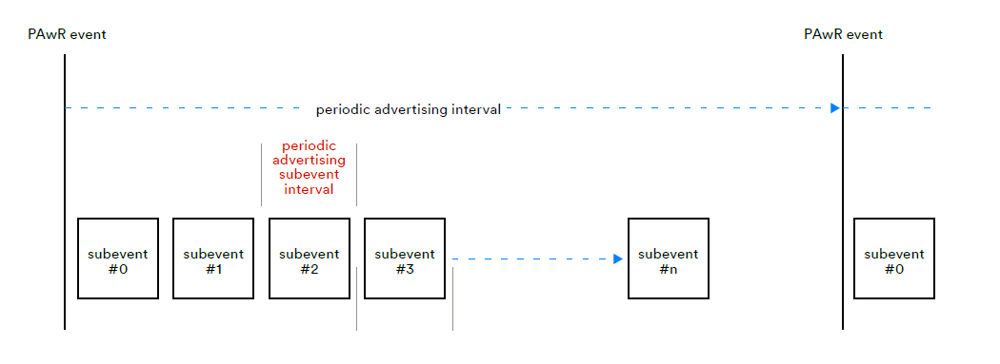
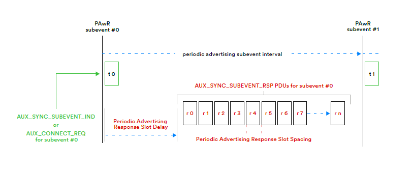
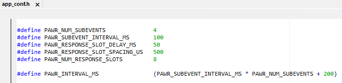

# STM32WB09 PAwR/ESL Demo

STM32WB09 PAwR/ESL application demonstrates the PAwR (Periodic Advertising with Response) feature of STM32WB0 Bluetooth stack. With the support of Periodic Advertising with Response, it is possible to have a bidirectional one-to-many communication between a single node and thousands of low-power devices. One of the most innovative applications addressed by this new feature, introduced by Bluetooth Core v5.4, is Electronic Shelf Label. 

This demo implements the Bluetooth ESL profile. Both roles, i.e. *Electronic Shelf Label* (ESL) and *Access Point* (AP) roles are provided. Each ESL is addressed by a Group ID (7-bit value) and an ESL ID (8-bit value). Addresses are assigned by the AP during the configuration phase of the node. In this first version of the Access Point, the BD addresses of the ESL are defined at compile time and Group ID and ESL ID are derived from the two least significant bytes of the public address. A command for ESL provisioning will be added in the future.

When ESL firmware starts, the device enters advertising state. The Access Point automatically connects to any of the predefined ESLs. Once it gets connected to the ESL, the ESL can receive the Periodic Advertising Synchronization Info so that it can synchronize with the periodic advertising train and disconnect the link. In particular, the device will only synchronize with the PAwR subevent corresponding to the group (e.g. ESL in group 0 is synchronized only with subevents 0).

Commands can be sent by the PAwR broadcaster Access Point. The human interface to the AP is an AT-like command set over UART interface (115200-8-N-1). See dedicated section below for further details.
Commands can either be unicast, i.e. addressed to a single device, or broadcast if addressed to all the ESLs of a group (ESL ID = 0xFF). Broadcast commands are retransmitted to increase reliability. Unicast commands always have a response from the ESL. If no response is received, a command is automatically retransmitted a limited amount of times, until the response is received from the ESL to confirm the reception of the command.

## Hardware Needed

The ESL application can run on any of these 2 boards:
- NUCLEO-WB09KE (firmware under *Projects/NUCLEO-WB09KE/Applications/BLE/BLE_ESL*)
- STEVAL-ESL1KCB (firmware under *Projects/STEVAL-ESL1KCB/Applications/BLE_ESL*)

The AP application can run on:
- NUCLEO-WB09KE (firmware under *Projects/NUCLEO-WB09KE/Applications/BLE_ESL_AP*)

### STEVAL-ESL1KCB

Even though this demo can run on Nucleo boards, with a reduced set of commands, it can be run also on a dedicated board, STEVAL-ESL1KCB. This board is an example of a real Electronic Shelf Label, with 1.54-inches e-paper display and NFC tag.

These are the main components in the ESL board:
- STM32WB09KE ultra-low power programmable Bluetooth Low Energy SoC
- 1.54-inches e-paper display
- ST25DV, a dynamic NFC/RFID tag IC with I2C interface
- NFC antenna (under the display)
- LED
- Button for user interaction
- Reset button
- Battery holder for CR2032 batteries

## Software Needed

- Serial Terminal program, like [Tera Term](https://teratermproject.github.io/index-en.html)

- IDE, required only to compile source code:

  - [IAR EWARM](https://www.iar.com/products/architectures/arm/iar-embedded-workbench-for-arm/)
  - [Keil MDK-ARM](https://developer.arm.com/Tools%20and%20Software/Keil%20MDK)
  - [STM32CubeIDE](https://www.st.com/en/development-tools/stm32cubeide.html)

- [STM32CubeProgrammer](https://www.st.com/en/development-tools/stm32cubeprog.html) to program the prebuilt binaries (not required if an IDE is used).

## User's Guide

This section describes the steps to set-up and run the demo.

1. Flash ESL boards (either Nucleo-WB09KE or STEVAL-ESL1KCB), with ESL firmware binaries. Each board needs to have its own public address (it can be set through CFG_PUBLIC_BD_ADDRESS macro in app_conf.h). Firmware can be flashed either with IDE or STM32CubeProgrammer.  
_Note_: if the board was already programmed with a firmware using Deepstop mode, it may be not possible to use SWD interface to program a new firmware. In this case the STM32WB09 device can be forced to enter bootloader mode to make it possible to program a new firmware. On STEVAL-ESL1KCB, bootloader mode can be entered by pressing reset button while keeping user button pressed. On Nucleo-WB09KE the reset button must be pressed after placing a jumper on JP1 in *Bootloader mode* position.

2. For the AP on the Nucleo board, compile and flash the firmware with and IDE or use the STM32CubeProgrammer to flash the precompiled binary file.  
_Note_: if the board was already programmed with a firmware using Deepstop mode, it may be not possible to use SWD interface to program a new firmware. In this case the STM32WB09 device can be forced to enter bootloader mode to make it possible to program a new firmware. On Nucleo-WB09KE, bootloader mode can be entered by pressing reset button while keeping JP1 in *Bootloader mode* position.

3. Optional: open a terminal to view messages on the COM port associated to the ESL boards (the COM port is provided by the ST-Link). UART settings are:
    - Baud rate 921600 bps
    - Data bits: 8
    - Parity: none
    - Stop bits: 1.

4. Reset ESL boards by pushing reset button.  
If you have a terminal opened on the ESL COM port, some messages are printed, showing that the board is initialized and advertising.

5. Open a terminal on COM port associated to AP board. UART settings are:
    - Baud rate 115200 bps
    - Data bits: 8
    - Parity: none
    - Stop bits: 1.
Make sure also to set the terminal to send a CR character after a new line.

6. Reset AP board to see some info on the terminal. The firmware tries automatically to connect to the pre-configured ESL boards to pass PAwR train sync info. Once an ESL received the Synchronization information, it immediately disconnects the link.  
This is the log on the Access Point after the configuration of an ESL. The assigned ESL address is higlighted by the red arrow. The most significant byte of the ESL address is the Group ID, while the least significant byte is the ESL ID.  
  
Below the log on the ESL after the connection to the AP.
  

7. Insert AT commands on the AP terminal to send commands to ESLs. See section below for a list of supported commands.  
Type ATE to enable local echo.  

For example, you can:
  - Turn on an LED on ESL with address 1,2 (Group ID 1, ESL ID 2) by typing:  
    *AT+LED=1,2,0,FF,0,0,0,1*
  - Turn off the LED on ESL with address 1,2 with:  
    *AT+LED=1,2,0,FF,0,0,0,0*
  - Read the battery level on ESL 1,2 with:  
    *AT+SENS=1,2,0*
  - Send a short text, e.g. "Peaches", to be displayed on ESL 1,2 (supported only for STEVAL-ESL1KCB):  
    *AT+TXT=1,2,Peaches*
  - Set the price on ESL 1,2 (supported only for STEVAL-ESL1KCB):  
    *AT+PRICE=1,2,4.95*
  - Set an icon for discount on ESL 1,2 (supported only for STEVAL-ESL1KCB):  
    *AT+IMG=1,2,0,1*
  - Turn on the LED on all the ESLs of Group 1 with:  
    *AT+LED=1,FF,0,FF,0,0,0,1*  

When not synchronized with the Access Point, after a loss of synchronization, the ESL is in low power advertising state. A press to the push button makes the device enter fast advertising for a limited amount of time (90 seconds).

On STEVAL-ESL1KCB, a long press on the button (> 1.5 s) clears the screen (useful to be done before storing the board for a long time to avoid damage to the display).

## AT commands

Each command starts with *AT* and ends with a \<CR> character (ASCII: 13).  
A *"\<CR\>\<LF\>OK\<CR>\<LF>"* or *\<CR\>\<LF\>"ERROR\<CR>\<LF>"* string is given after a command is received and processed locally.  
All the AT commands to send ESL commands on PADV channel have *\<group_id>* and *\<esl_id>* as the first two parameters, which identify the ESL. Commands can be sent in broadcast to all the ESLs in the group, by giving FF as *\<esl_id>*. However, when broadcast commands are sent, no response can be received from ESLs. Broadcast commands are automatically retransmitted to increase reliability.

When a response is received from the peer, this is notified on the terminal with a string like  
*\<CR\>\<LF\>+\<RESP>:\<group_id>,\<esl_id>,\<status>\[,params]\<CR\>\<LF\>*  
where status is 0 if the response has been received successfully. *status* may be followed by a list of other parameters, depending on the command. 

Here is the list of supported commands on the Access Point. The presence of \<CR\>\<LF\> is implied. Some of these commands (i.e. the ones which require a display) can only have a real effect when the ESL is an STEVAL-ESL1KCB.

- *ATE*: Enable local echo.
- *AT+PING=\<group_id\>,\<esl_id\>*: Ping.  
  When a response is received from the peer, the following string is given:  
  *+STATE:\<group_id>,\<esl_id>,\<status>,\<state\>*  
  where *\<state\>* is the basic state of the ESL (as described in specifications).
- *AT+UNASSOC=\<group_id\>,\<esl_id\>*: Unassociate from AP.  
   When a response is received from the peer, the following string is given:  
  *+STATE:\<group_id>,\<esl_id>,\<status>,\<state\>*  (see AT+PING).
- *AT+SRVRST=\<group_id\>,\<esl_id\>*: Service Reset.  
  When a response is received from the peer, the following string is given:  
  *+STATE:\<group_id>,\<esl_id>,\<status>,\<state\>*  (see AT+PING).
- *AT+FRST=\<group_id\>,\<esl_id\>*: Factory Reset.  
   No response is given by the ESL.
- *AT+UPDCMP=\<group_id\>,\<esl_id\>*: Send and Update Complete command to the connected ESL.
- *AT+SENS=\<group_id\>,\<esl_id\>,\<sensor_index\>*: Read Sensor Data  
  When a response is received from the peer, the following string is given:  
  *+SENS:\<group_id>,\<esl_id>,\<status>,\<sensor_value\>*  
  In this example, value 0 for \<sensor_index\> is used to read battery voltage (in millivolts)
- *AT+REFRESH=\<group_id\>,\<esl_id\>,\<display_index\>*: Refresh Display.  
  When a response is received from the peer, the following string is given:  
  *+DISP:\<group_id>,\<esl_id>,\<status>,\<display_index\>,\<image_index\>*
- *AT+IMG=\<group_id\>,\<esl_id\>,\<display_index\>,\<image_index\>*: Display Image. 
  When a response is received from the peer, the following string is given:  
  *+DISP:\<group_id>,\<esl_id>,\<status>,\<display_index\>,\<image_index\>*
- *AT+IMGTIM=\<group_id\>,\<esl_id\>,\<display_index\>,\<image_index\>,\<absolute_time\>*: Display Timed Image.  
  When a response is received from the peer, the following string is given:  
  *+DISP:\<group_id>,\<esl_id>,\<status>,\<display_index\>,\<image_index\>*
- *AT+LED=\<group_id\>,\<esl_id\>,\<led_index\>,\<led_component\>,\<pattern\>,\<off_period\>,\<on_period\>,\<repeat\>*: LED Control  
  When a response is received from the peer, the following string is given:  
  *+LED:\<group_id>,\<esl_id>,\<status>*
- *AT+LEDTIM=\<group_id\>,\<esl_id\>,\<led_index\>,\<led_component\>,\<pattern\>,\<off_period\>,\<on_period\>,\<repeat\>,\<absolute_time\>*: LED Timed Control.  
  When a response is received from the peer, the following string is given:  
  *+LED:\<group_id>,\<esl_id>,\<status>*
- *AT+TXT=\<group_id\>,\<esl_id\>,\<text\>*: Set text. This is a proprietary command to set a text on the ESL display.  
  \<text\> can be a string with maximum 15 characters.  
  When a response is received from the peer, the following string is given:  
  *+TXT:\<group_id>,\<esl_id>,\<status>*
- *AT+PRICE=\<group_id\>,\<esl_id\>,\<price\>*: Set price. This is a proprietary command to set a price on the ESL display.  
  When a response is received from the peer, the following string is given:  
  *+PRICE:\<group_id>,\<esl_id>,\<status>*
- *AT+RECONF=\<group_id\>,\<esl_id\>,\<new_group_id\>,\<new_esl_id\>*: Reconfigure an ESL with a new address. The AP automatically connects to the ESL to assign a new address.
- *AT+CONN=\<group_id\>,\<esl_id\>*: Connect to an ESL (ESL enters *updating state*). Use AT+UPDCMP to make the ESL disconnect.
- *AT+INFO*: Read all the Information Characteristics from the connected ESL.
- *AT+DISPLAYINFO*: Read the Display Information Characteristic from the connected ESL.
- *AT+SENSORINFO*: Read the Sensor Information Characteristic from the connected ESL.
- *AT+LEDINFO*: Read the LED Information Characteristic from the connected ESL.
- *AT+CLRSCDB*: Delete all bonding information
- *AT+ABSTIME?*: Read current absolute time
- *AT+HELP*: List of AT commands.

## Demo on STEVAL-ESL1KCB

When the firmware on the ESL board starts to run, the display is initialized by showing only a static background, without any text or price.

 
On the top-right corner, a circle is used to show the current state of the ESL connectivity:
- No circle: no Bluetooth activity (no advertising, not synchronized with AP).
- Empty circle: ESL advertising, not synchronized.
- Full circle: ESL synchronized with AP.

By launching some ESL commands from Access Point, it is possible to do the following operation on the ESL:
- Setting a text for a short description of the item (a maximum of 10 characters). Use *AT+TXT* command on the AP.
- Setting the price of the item (up to 999.99). Use *AT+PRICE* command on the AP.
- Setting a special icon (e.g. to show a discount). Use *AT+IMG* command on the AP.
- Activate an LED. Use *AT+LED* command on the AP.

The NFC tag is used to program an URI that is pointing to more product info on a website. The product can be identified by the ESL address (Group ID and ESL ID).

Below an image showing an ESL board with item description and price set.

## Performances

The PAwR train can be customized by changing several parameters. To shortly describe a PAwR advertising, it is composed of PAwR events occurring at fixed intervals, called *periodic advertising intervals*. Each PAwR events is made by subevents, where packets are transmitted. The interval between two consecutive subevents is called *periodic advertising subevent interval*. This is illustrated in the figure below.

At the beginning of a subevent, the Broadcaster transmits one packet, and after a *periodic advertising response slot delay* it can receive responses from observer devices inside the so-called *response slots* (one response packet in a single response slot). The interval between the start of two consecutive response slots is the *periodic advertising response slot spacing*. 
 

All these parameters can be controlled on the Access Point through macros defined in *app.conf.h*.

 

- **PAWR_NUM_SUBEVENTS**: the number of subevents. It limits the number of supported groups, because subevent #n is used to address only devices belonging to Group ID #n. The maximum number of subevents supported by the Bluetooth stack is equal to CFG_BLE_NUM_PAWR_SUBEVENTS.
- **PAWR_SUBEVENT_INTERVAL_MS**: the interval (in milliseconds) between the start of two PAwR subevents.
- **PAWR_RESPONSE_SLOT_DELAY_MS**: the interval between the start of the subevent and the first response slot.
- **PAWR_RESPONSE_SLOT_SPACING_US**: the interval in microseconds between the beginning of two response slots. It must be long enough to let the observer send the response packet.
- **PAWR_NUM_RESPONSE_SLOTS**: the number of response slots in the subevent. 

The latest four parameters must be chosen so that the all the response slots can fit inside a subevent: *PAWR_SUBEVENT_INTERVAL_MS > PAWR_RESPONSE_SLOT_DELAY_MS + (PAWR_RESPONSE_SLOT_SPACING_US * PAWR_NUM_RESPONSE_SLOTS)/1000*.

- **PAWR_INTERVAL_MS**: the interval in milliseconds between the starts of two PAwR events. Default value it set to *(PAWR_SUBEVENT_INTERVAL_MS \* PAWR_NUM_SUBEVENTS + 200)* to make sure the periodic advertising interval is long enough to accommodate all the subevents, leaving 200 ms of interval at the end of the last subevent.

With the default values of the macros, i.e. 4 subevents with 100 ms of subevent interval, the periodic advertising interval is set to 600 ms. This value has been chosen to gives a reasonable latency while keeping power consumption low. However, in a real scenario, where ESLs must be working for years before replacing the battery, this value may still be too aggressive. It is more common to have periodic intervals in the order of seconds, since there is no need to have a short response time.

## NFC (on STEVAL-ESL1KCB)

This section only applies to STEVAL-ESL1KCB evaluation kit. This board has an NFC tag, which is programmed with an URL. When the user taps the ESL screen with his phone, a notification with a link to a webpage appears. The URL contains some info on the ESL, like ESL address and price, together with an identifier of the NFC tag.

## Notes

The original PAwR applications from release 1.0.0 (not compliant to the ESL profile) are still provided in the following folders:
- Projects\\NUCLEO-WB09KE\\Applications\\BLE\\BLE_PAwR_Broadcaster
- Projects\\NUCLEO-WB09KE\\Applications\\BLE\\BLE_PAwR_Observer
- Projects\\STEVAL-ESL1KCB\\Applications\\BLE\\BLE_PAwR_Observer

## Troubleshooting

**Caution** : pull-requests are **not supported** to submit problems or suggestions related to the software delivered in this repository. The STM32WB09 PAwR/ESL example is being delivered as-is, and not necessarily supported by ST.

**For any other question** related to the product, the hardware performance or characteristics, the tools, the environment, you can submit it to the **ST Community** on the STM32 MCUs related [page](https://community.st.com/s/topic/0TO0X000000BSqSWAW/stm32-mcus).